# Documentacao UML completa - TECHNOVINHO

Responsavel: Pedro Lucas
Sprint: 4
Base revisada: `develop` em 2026-05-27

## Objetivo

Registrar a visao UML completa da solucao TECHNOVINHO a partir da estrutura
atual do codigo, cobrindo arquitetura, implantacao, dominio, banco de dados,
casos de uso, fluxos principais e estados de agendamento.

## Criterios de aceite

| Criterio | Status | Evidencia |
| --- | --- | --- |
| Documentar arquitetura geral da solucao | Atendido | Diagrama de componentes |
| Documentar deploy Docker Compose | Atendido | Diagrama de implantacao |
| Documentar entidades e relacionamentos | Atendido | Diagramas ER e classes de dominio |
| Documentar casos de uso por perfil | Atendido | Diagrama de casos de uso |
| Documentar fluxos principais | Atendido | Diagramas de sequencia |
| Documentar estados do agendamento | Atendido | Diagrama de estados |
| Rastrear a documentacao aos arquivos reais | Atendido | Secao de rastreabilidade |

## Escopo funcional coberto

- Autenticacao e autorizacao por JWT.
- Cadastro e login de usuarios.
- CRUD de servicos por administrador.
- Cadastro e manutencao de profissionais por administrador.
- Cadastro e consulta de disponibilidade por profissional.
- Agendamento por cliente.
- Cancelamento por cliente ou administrador.
- Conclusao de atendimento por administrador.
- Dashboard administrativo e historico de agendamentos.
- Validacoes de seguranca, disponibilidade, conflito e desempenho.

## Diagrama de componentes

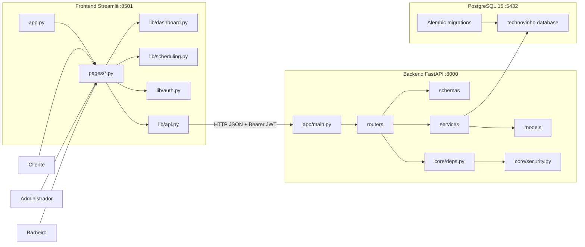

## Diagrama de implantacao

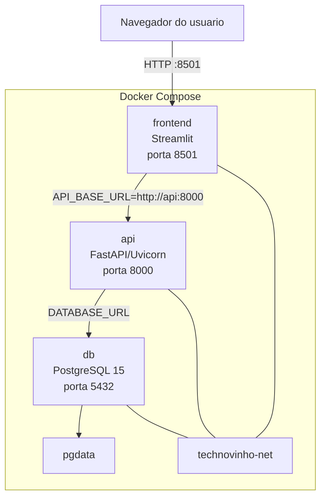

## Diagrama ER

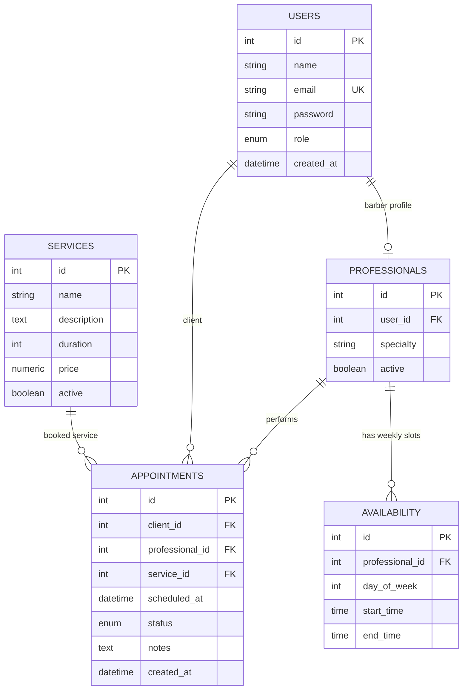

## Diagrama de classes de dominio

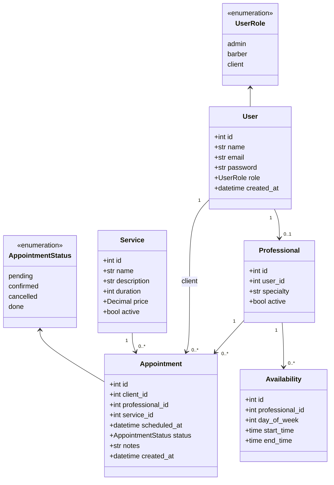

## Diagrama de camadas do backend

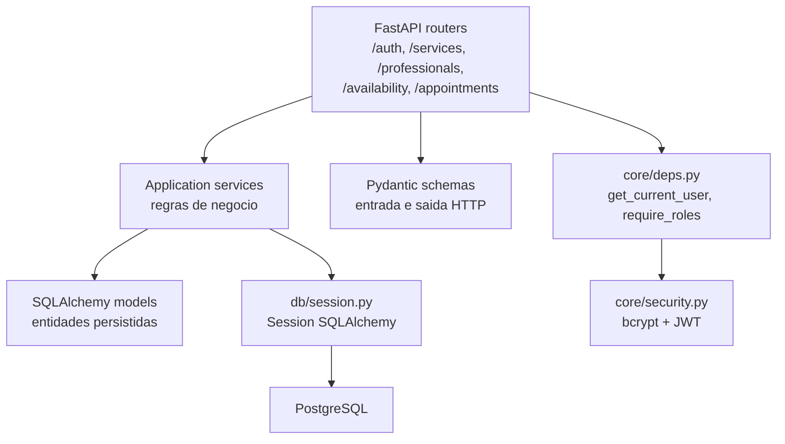

## Casos de uso por perfil

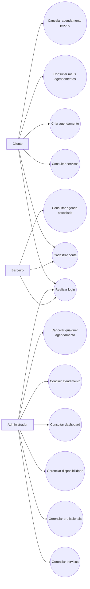

## Sequencia: cadastro e login

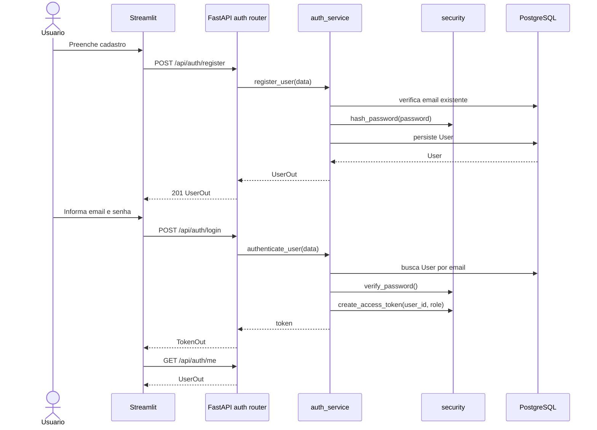

## Sequencia: agendamento pelo cliente

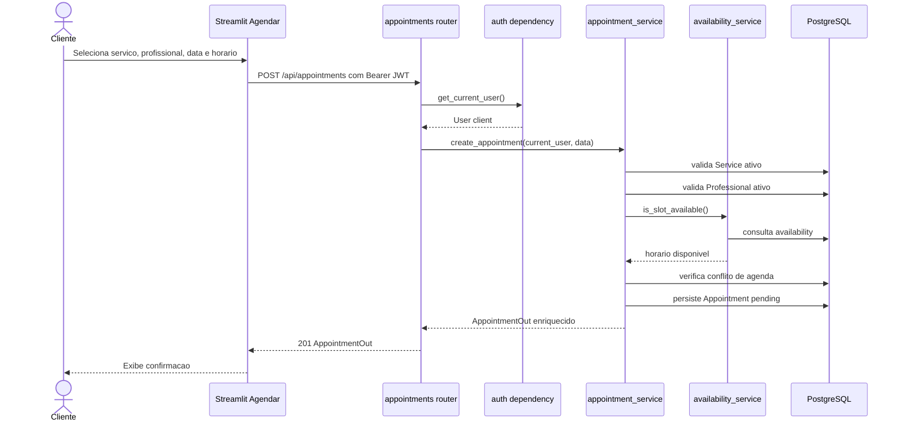

## Sequencia: cancelamento e conclusao

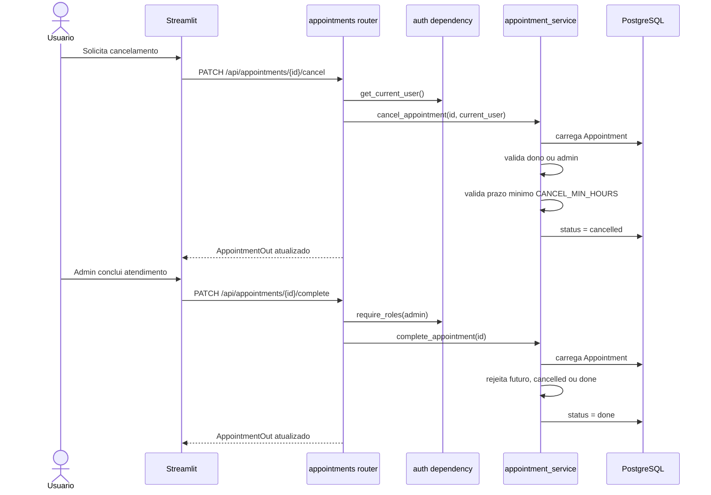

## Sequencia: CRUD de servicos

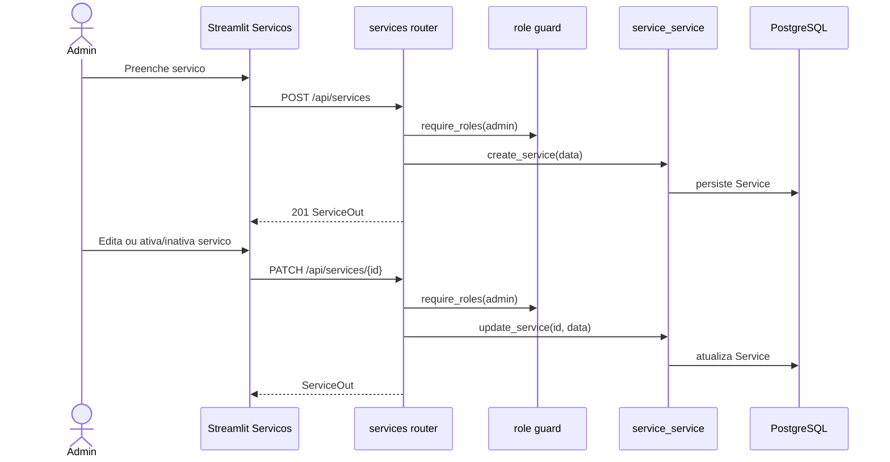

## Sequencia: profissionais e disponibilidade

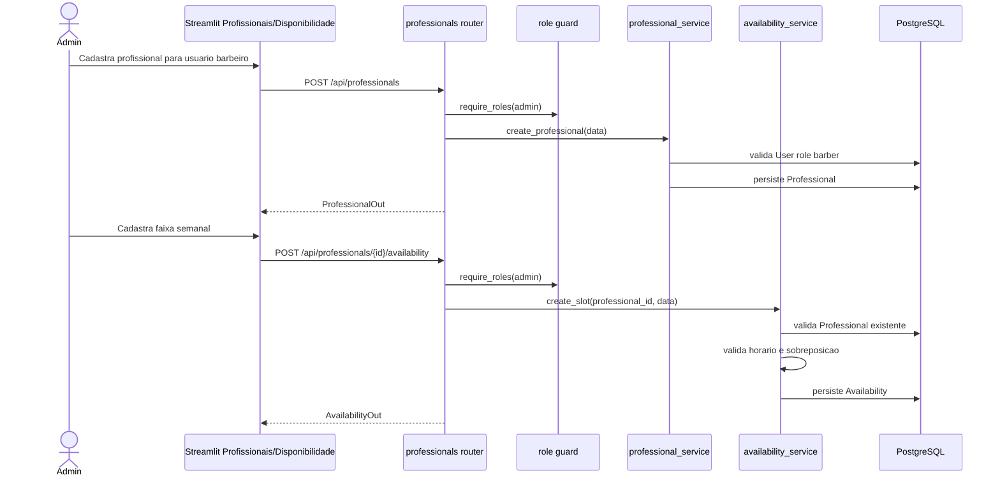

## Estados do agendamento

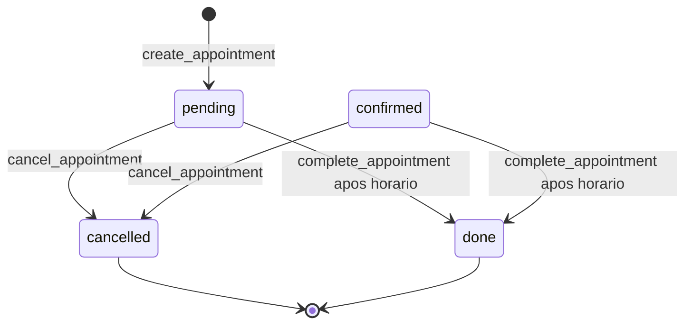

## Navegacao e responsabilidades do frontend

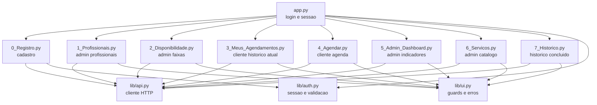

## Regras de negocio representadas

- Somente `client` cria agendamento.
- Somente `admin` cria/edita servicos.
- Somente `admin` cria/edita profissionais e disponibilidade.
- Um profissional deve estar vinculado a usuario com role `barber`.
- Um usuario barbeiro possui no maximo um registro em `professionals`.
- Um agendamento precisa de servico ativo, profissional ativo e horario futuro.
- O horario precisa caber na disponibilidade semanal do profissional.
- Agendamentos nao cancelados nao podem se sobrepor para o mesmo profissional.
- Cancelamento respeita `CANCEL_MIN_HOURS`.
- Atendimento futuro nao pode ser marcado como concluido.

## Rastreabilidade para arquivos do projeto

| Tema | Arquivos |
| --- | --- |
| API principal | `backend/app/main.py` |
| Autenticacao | `backend/app/routers/auth.py`, `backend/app/services/auth_service.py`, `backend/app/core/security.py` |
| Guards de seguranca | `backend/app/core/deps.py` |
| Servicos | `backend/app/routers/services.py`, `backend/app/services/service_service.py`, `backend/app/models/service.py` |
| Profissionais | `backend/app/routers/professionals.py`, `backend/app/services/professional_service.py`, `backend/app/models/professional.py` |
| Disponibilidade | `backend/app/routers/availability.py`, `backend/app/services/availability_service.py`, `backend/app/models/availability.py` |
| Agendamentos | `backend/app/routers/appointments.py`, `backend/app/services/appointment_service.py`, `backend/app/models/appointment.py` |
| Usuarios | `backend/app/models/user.py`, `backend/app/schemas/auth.py` |
| Banco e migrations | `backend/alembic/versions/`, `docs/MODELO_DADOS.md` |
| Frontend Streamlit | `frontend/app.py`, `frontend/pages/*.py`, `frontend/lib/*.py` |
| Deploy | `docker-compose.yml`, `backend/Dockerfile`, `frontend/Dockerfile` |
| Testes de apoio | `tests/integration/`, `tests/frontend/`, `tests/ui/` |

## Observacoes

- Os diagramas foram escritos em Mermaid para serem renderizados diretamente em
  plataformas compatveis com Markdown, como GitHub.
- Esta documentacao representa o estado atual do codigo no momento da task.
- Alteracoes futuras em rotas, modelos, regras de negocio ou telas devem
  atualizar este documento.
